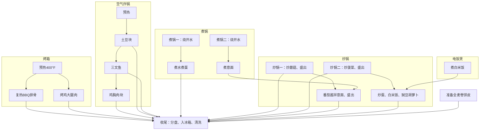

+++
date = '2026-08-30T11:43:05-0400'
title = '减肥饮食锻炼计划'
slug = '06e58c7'
aliases = ['/posts/healthy-eating-plan/']
+++

## 饮食

### 计划表

早餐：混合水果400 g + 高纤维谷物早餐40 g + 无糖豆奶200 g + 一水肌酸 5g。

| 编号 | 星期 | 餐次 | 碳水 | 蛋白质 | 蔬菜 | 热量（kcal） |
|---|---|---|---|---|---|---:|
| 1 | 周日 | 午餐 | 土豆块 | BBQ排骨半盒＋水煮蛋1个 | 蘑菇 | 767 |
| 2 | 周日 | 晚餐 | 意面 | 鸡大腿肉1块＋三文鱼1块 | 番茄 | 728 |
| 3 | 周一 | 午餐 | 白米饭 | 鸡胸肉1块＋炒蛋1.5个 | 豌豆胡萝卜 | 736 |
| 4 | 周一 | 晚餐 | 卷饼皮 | 鸡大腿肉2块＋水煮蛋2个 | 蘑菇 | 712 |
| 5 | 周二 | 午餐 | 土豆块 | 三文鱼2块 | 菠菜 | 719 |
| 6 | 周二 | 晚餐 | 白米饭 | 鸡胸肉1块＋炒蛋1.5个 | 豌豆胡萝卜 | 736 |
| 7 | 周三 | 午餐 | 卷饼皮 | 鸡大腿肉2块＋水煮蛋2个 | 蘑菇 | 712 |
| 8 | 周三 | 晚餐 | 土豆块 | BBQ排骨半盒＋水煮蛋1个 | 蘑菇 | 767 |
| 9 | 周四 | 午餐 | 意面 | 鸡大腿肉1块＋三文鱼1块 | 番茄 | 728 |
| 10 | 周四 | 晚餐 | 白米饭 | 鸡胸肉1块＋炒蛋1.5个 | 豌豆胡萝卜 | 736 |
| 11 | 周五 | 午餐 | 意面 | 鸡大腿肉1块＋三文鱼1块 | 番茄 | 728 |
| 12 | 周五 | 晚餐 | 土豆块 | 三文鱼2块 | 菠菜 | 719 |
| 13 | 周六 | 午餐 | 白米饭 | 鸡胸肉1块＋炒蛋1.5个 | 豌豆胡萝卜 | 736 |
| 14 | 周六 | 晚餐 | 意面 | 鸡大腿肉1块＋三文鱼1块 | 番茄 | 728 |
{.table-centered}

### 购物表

<!--
采购口径：价格为截图或官网参考价，按周用量分摊，未含税及配送；称重商品以实收净重计，门店库存和售价可能变化。固定采购以正文购物表为准，肌酸在Walmart购买，其余在Metro购买。
意面UPC064200130714对应PROTEIN+ Spaghetti 340g，Metro标题曾误标Garden Select；厂家规格：https://www.barillaforprofessionals.com/media/en-us/filer_public/5f/99/5f9986d1-7ada-4ea6-9fcc-9347e9560514/catelli_protein_sellsheet_0824_fre.pdf
鸡胸肉每周两盒共四块，按用户指定518g/盒、1036g/周；每餐一块约259g生重，价格按原参考$29.75/kg约$30.82/周。BBQ熟猪背排骨商品059749881203，每周一盒680g（含骨和酱汁），均分第1、8盘；营养暂按全盒450g熟可食部分、每餐225g估算，非实测出肉率。截图参考$15.99/盒，实际以结账为准。
Selection豌豆胡萝卜每罐沥干260g仍为估计，旧品牌的实测不能当作新品牌实测。
白米为Selection Long Grain White Rice 900g，Metro参考价$2.99/袋。整周一次干米270mL（180mL量杯的1.5杯），暂按0.8g/mL估约216g，均分四餐，费用约$0.72。一袋约用4.2周，按需补货。体积换算生重为估计，实称后可校准。米水体积比1:1，配水270mL。
-->

| 食材 | 商品 | 购买频率 | 每周价格（CAD） |
| --- | --- | ---: | ---: |
| 去骨去皮鸡大腿肉 | [Boneless Skinless Chicken Thighs](https://www.metro.ca/en/online-grocery/aisles/meat-poultry/chicken-turkey/legs-drumsticks-wings/boneless-skinless-chicken-thighs/p/246800) 约460 g / 盒 | 2盒 / 周 | 约$20.26 |
| BBQ熟猪背排骨 | [Irrésistible Frozen BBQ Pork Back Ribs](https://www.metro.ca/en/online-grocery/aisles/meat-poultry/frozen-meat/pork/frozen-cooked-pork-back-ribs/p/059749881203) 680 g / 盒，含骨及酱汁；营养暂估450 g可食部分 / 盒 | 1盒 / 周 | $15.99 |
| 三文鱼 | [Fresh Skin-On Atlantic Salmon Portion](https://www.metro.ca/en/online-grocery/aisles/fish-seafood/fresh-fish/salmon-trout-tuna/fresh-skin-on-atlantic-salmon-portion/p/229257) 113 g / 块 | 8块 / 周 | $39.92 |
| 去骨去皮鸡胸肉 | [Prime Boneless Skinless Chicken Breasts](https://www.metro.ca/en/online-grocery/aisles/meat-poultry/chicken-turkey/breasts/boneless-skinless-chicken-breasts/p/244931) 518 g / 盒、2块 | 2盒 / 周 | 约$30.82 |
| 鸡蛋 | [Selection Large Eggs](https://www.metro.ca/en/online-grocery/aisles/dairy-eggs/eggs/whole-eggs/large-white-eggs/p/059749896054) 12个 / 盒 | 1盒 / 周 | $3.99 |
| 无糖豆奶 | [Silk Soy Milk Alternative, Unsweetened, Dairy Free](https://www.metro.ca/en/online-grocery/aisles/dairy-eggs/milk-cream-butter/lactose-free-non-dairy-milk/organic-unsweetened-fortified-soy-beverage/p/025293000735) 1.89 L / 桶 | 2桶 / 周 | $11.98 |
| 桃子蓝莓无气泡水 | [Flow Organic Blueberry and Peach Spring Water](https://www.metro.ca/en/online-grocery/aisles/beverages/water/bottled-water/organic-blueberry-and-peach-spring-water/p/840277001283) 1 L / 盒，无气泡版 | 4盒 / 周 | $11.96 |
| Fresca无糖汽水 | [Fresca Sugar-Free Grapefruit Flavoured Soft Drink](https://www.metro.ca/en/online-grocery/aisles/beverages/soft-drinks/citrus-lemon-lime/sugar-free-grapefruit-flavoured-soft-drink/p/067000104923) 12罐×355 mL / 箱 | 1箱 / 周 | $9.49 |
| 土豆 | [Metro White Potato](https://www.metro.ca/en/online-grocery/aisles/fruits-vegetables/vegetables/potatoes-carrots-celery/white-potato/p/4083) 约300 g / 个，参考$1.94 / 个 | 3个 / 周，约900 g | $5.82 |
| 豌豆胡萝卜 | [Selection Peas and Carrots, Packed in Season](https://www.metro.ca/en/online-grocery/aisles/pantry/canned-jarred/vegetables/peas-and-carrots/p/059749887618) 398 mL / 罐，沥干约260 g | 2罐 / 周 | $2.98 |
| 蘑菇 | [Belle Grove Crimini Mushroom Slices](https://www.metro.ca/en/online-grocery/aisles/fruits-vegetables/vegetables/mushrooms/crimini-mushroom-slices/p/887462000157) 227 g / 盒 | 2盒 / 周 | $7.98 |
| 嫩菠菜 | [Fresh Attitude Organic Baby Spinach](https://www.metro.ca/en/online-grocery/aisles/fruits-vegetables/packaged-salads-vegetables/organic-baby-spinach/p/888048100018) 142 g / 盒 | 2盒 / 周 | $10.98 |
| 番茄意面酱 | [Catelli Garden Select Tomato & Basil Pasta Sauce](https://www.metro.ca/en/online-grocery/aisles/pantry/canned-jarred/pasta-pasta-sauces/tomato-basil-pasta-sauce/p/064200010122) 600 mL / 瓶 | 1瓶 / 周 | $3.99 |
| 混合水果盘 | [Fresh Fruit Carousel](https://www.metro.ca/en/online-grocery/aisles/fruits-vegetables/fresh-cut-fruits-vegetables/fresh-fruit-carousel/p/204900) 1.4 kg / 盒 | 2盒 / 周 | $29.98 |
| 意面 | [Catelli PROTEIN+ Spaghetti Pasta](https://www.metro.ca/en/online-grocery/aisles/pantry/pasta-rice-beans/pasta/spaghetti-pasta/p/064200130714) 340 g / 包 | 按需补 | $3.82 |
| 全麦卷饼皮 | [Dempster’s 100% Whole Wheat Large Tortillas](https://www.metro.ca/epicerie-en-ligne/allees/pains-et-patisseries/tortillas-et-pains-plats/tortillas/tortillas-de-ble-entier/p/068721038252) 610 g / 袋 | 按需补 | $1.20 |
| 白米 | [Selection Long Grain White Rice](https://www.metro.ca/en/online-grocery/aisles/pantry/pasta-rice-beans/rice/long-grain-white-rice/p/059749902373) 900 g / 袋 | 按需补 | $0.72 |
| 高纤维谷物早餐 | [Fibre One Crunchy Original 587 g](https://www.metro.ca/en/online-grocery/aisles/pantry/cereals-spreads-syrups/granola-healthier-cereals/original-flavoured-crunchy-cereal/p/065633186040) 587 g / 盒 | 按需补 | $4.29 |
| 黑胡椒 | [Selection Ground Black Pepper](https://www.metro.ca/en/online-grocery/aisles/pantry/herbs-spices-sauces/salt-pepper/ground-black-pepper/p/059749889094) 105 g / 瓶 | 按需补 | $0.19 |
| 蒜粉 | [Selection Garlic Powder](https://www.metro.ca/en/online-grocery/aisles/pantry/herbs-spices-sauces/spices/garlic-powder/p/059749889254) 120 g / 瓶 | 按需补 | $0.45 |
| 洋葱粉 | [Selection Onion Powder](https://www.metro.ca/en/online-grocery/aisles/pantry/herbs-spices-sauces/spices/onion-powder/p/059749889384) 100 g / 瓶 | 按需补 | $0.25 |
| 红椒粉 | [Selection Paprika](https://www.metro.ca/en/online-grocery/aisles/pantry/herbs-spices-sauces/spices/paprika/p/059749889018) 95 g / 瓶 | 按需补 | $0.36 |
| 干牛至叶 | [Selection Oregano Leaves](https://www.metro.ca/en/online-grocery/aisles/pantry/herbs-spices-sauces/spices/oregano-leaves/p/059749888936) 30 g / 瓶 | 按需补 | $0.10 |
| 意式混合香草 | [Selection Italian Seasoning](https://www.metro.ca/en/online-grocery/aisles/pantry/herbs-spices-sauces/herb-spice-blends/italian-seasoning/p/059749888899) 35 g / 瓶 | 按需补 | $0.09 |
| 玉米淀粉 | [Selection Corn Starch](https://www.metro.ca/en/online-grocery/aisles/pantry/baking-ingredients/flour-baking-essentials/corn-starch/p/059749887199) 454 g / 盒 | 按需补 | $0.25 |
| 盐 | [Windsor Iodized Table Salt](https://www.metro.ca/en/online-grocery/aisles/pantry/herbs-spices-sauces/salt-pepper/iodized-table-salt/p/066010001055) 1 kg / 盒 | 按需补 | $0.01 |
| 橄榄油 | [Terra Delyssa Premium Extra Virgin Olive Oil](https://www.metro.ca/en/online-grocery/aisles/pantry/oils-vinegars/olive-oil/extra-virgin-olive-oil/p/6191509903627) 1 L / 瓶 | 按需补 | $0.72 |
| 一水肌酸 | [LEANFIT SPORT Creatine Monohydrate — Unflavoured（Walmart）](https://www.walmart.ca/fr/ip/leanfit-sport-creatine-monohydrate-en-poudre-non-aromatis-300-g-5-g-de-cratine-par-portion-certification-informed-choice-cratine-micronise-et-de-quali/6000208594600) 无味，300 g / 罐，参考$27.98 | 按需补，约60天 / 罐 | 约$3.26 |
| 每周合计 | — | — | $221.85 |
{.table-centered}

<!--
维护约定：正文保持简短，保留购物、营养和训练表及商品链接。米饭、意面等取用量写在对应流程，调味量保留在调味表，分盘表均分的只写盘号，不均分的简写盘号和数量。每个厨具线程内同一食材的操作合并为一个条目，不把准备和烹调拆成多个条目。计算依据、饮用分配和隐私信息仅留在隐藏备注；不再追加逐次修改历史。
-->

### 并行做菜流程

<!-- 
1茶匙 = 5 mL；以下时间均为参考。

周六晚上备餐；第1–8盘冷藏、第9–14盘当天冷冻，周三至周五每天早上将明天两餐移入冷藏。所有带水煮蛋餐为第1、4、7、8盘，不冷冻。冷藏餐须及时分浅盒降温、全程≤4°C，并在烹调后4天内吃完；这是熟食3–4天建议的上限，不是无条件保证，不能等全部线程结束才入冰箱。依据：https://www.canada.ca/en/health-canada/services/general-food-safety-tips/safe-food-storage.html 。-->

<!--
鸡肉和三文鱼按冷藏状态开始烹调。排骨为冷冻全熟产品，按实物包装说明复热，中心须达74°C。水煮蛋的蛋白和蛋黄须凝固。安全核对：https://www.canada.ca/en/health-canada/services/general-food-safety-tips/food-safety-you.html 。
-->

#### 任务依赖图

#### 分盘表

第1–14盘依次对应周日午餐至周六晚餐，每天先午后晚。1–8盘冷藏；9–14盘冷冻，周三早上拿到冷藏解冻。

| 食材 | 分到第几盘 |
|---|---|
| BBQ排骨 | 1、8 |
| 鸡胸肉块 | 3、6、10、13 |
| 水煮蛋 | 1、8各1个；4、7各2个 |
| 三文鱼 | 2、9、11、14各1块；5、12各2块 |
| 鸡大腿肉 | 2、9、11、14各1块；4、7各2块 |
| 蛋炒饭 | 3、6、10、13 |
| 番茄意面 | 2、9、11、14 |
| 土豆块 | 1、5、8、12 |
| 全麦卷饼皮 | 4、7 |
| 蘑菇 | 1、4、7、8 |
| 菠菜 | 5、12 |
{.table-centered}

#### 电饭煲线程

<!-- 电饭煲 White Rice（白米）模式煮米约50分钟。 -->

1. 白米：干米270 mL淘洗沥干，加水270 mL，用 White Rice（白米）模式煮，需50分钟。

#### 烤箱线程

调味表：

| 食材 | 橄榄油 | 盐 | 黑胡椒 | 蒜粉 | 洋葱粉 | 红椒粉 | 干牛至叶 | 玉米淀粉 |
|---|---|---|---|---|---|---|---|---|
| 鸡大腿肉 | 1 茶匙 | 1/4 茶匙 | — | 1 茶匙 | 1 茶匙 | 2 茶匙 | 1 茶匙 | — |
{.table-centered}

1. 烤箱400°F预热，需15分钟。
2. 鸡大腿肉：擦干、调味；400°F烤25分钟；第2、9、11、14盘各放1块，第4、7盘各放2块。
3. BBQ排骨：按包装说明准备并复热；均分到第1、8盘。

#### 空气炸锅线程

调味表：

| 食材 | 橄榄油 | 盐 | 黑胡椒 | 蒜粉 | 洋葱粉 | 红椒粉 | 干牛至叶 | 玉米淀粉 |
|---|---|---|---|---|---|---|---|---|
| 土豆块 | 1 茶匙 | 1/4 茶匙 | 1/4 茶匙 | 1/2 茶匙 | 1/2 茶匙 | — | — | — |
| 三文鱼 | 1 茶匙 | 1/4 茶匙 | 1 茶匙 | — | — | 2 茶匙 | — | — |
| 鸡胸肉块 | 1 茶匙 | 1/8 茶匙 | 1/4 茶匙 | 1/2 茶匙 | — | 1 茶匙 | — | 10 茶匙 |
{.table-centered}

1. 空气炸锅400°F预热，需4分钟。
2. 土豆：冲洗、擦干、切块、调味；400°F烤15分钟；均分到第1、5、8、12盘。
3. 三文鱼：擦干、调味；400°F烤8分钟；第2、9、11、14盘各放1块，第5、12盘各放2块。
4. 鸡胸肉块：擦干、切块、调味；400°F烤12分钟；均分到第3、6、10、13盘。

#### 煮锅线程

##### 煮锅一

1. 水煮蛋：烧水，水开后放入鸡蛋6个，煮约8分钟；第1、8盘各放1个，第4、7盘各放2个。

##### 煮锅二

1. 意面：烧水，水开后放入干面260 g，煮8分钟。

#### 炒锅线程

调味表：

| 食材 | 橄榄油 | 黑胡椒 | 蒜粉 | 洋葱粉 | 意式混合香草 | 酱油 | 鸡粉 |
|---|---|---|---|---|---|---|---|
| 蛋炒饭 | 1 茶匙 | — | 1/2 茶匙 | 1/2 茶匙 | — | 6 茶匙 | 1/4 茶匙 |
| 菠菜 | 1 茶匙 | — | 1/2 茶匙 | 1/2 茶匙 | — | — | — |
| 番茄意面 | 1 茶匙 | 1/2 茶匙 | 1 茶匙 | — | 1 茶匙 | — | — |
| 蘑菇 | 1 茶匙 | 1/2 茶匙 | 1 茶匙 | 1 茶匙 | — | — | — |
{.table-centered}

##### 炒锅一（小）

1. 蘑菇：大火加油，加蘑菇加调味，炒约7分钟至熟；均分到第1、4、7、8盘。
2. 番茄意面：小火加油，加番茄意面酱1瓶，调味，煮2–3分钟；拌入意面煮约3分钟至热透；均分到第2、9、11、14盘。

##### 炒锅二（大）

1. 菠菜：大火加油，加菠菜加调味，炒约7分钟至熟；均分到第5、12盘。
2. 蛋炒饭：豌豆胡萝卜2罐沥干，鸡蛋6个打散；中火加油，倒入蛋液炒至凝固；加入豌豆胡萝卜，米饭，和调味；炒7分钟至熟；出锅均分到第3、6、10、13盘。

### 放纵餐

#### 常见放纵餐

额外加吃按整份热量扣减赤字；替代正餐只扣两餐热量差。无标签的餐品为粗估范围。

<!--
放纵餐估值依据：均为备选，不计固定饮食。bb.q整份1156kcal来自用户菜单截图；其余五款没有对应整份营养标签，以下为配料拆分估计，非餐厅公布值。
凯撒卷：卷饼约750–1000，加默认薯条350–500kcal；炸鸡汉堡：面包200–250、鸡肉400–550、酱和凉拌菜150–250kcal，不含薯条饮料，买一送一不自动按吃两个算。
鸡排套餐计鸡排、米饭、2个饺子、3块yam配菜、汤沙拉及酱，约1100–1600kcal；yam具体形式未确认。
脆鸡沙威玛卷按Regular整份含两种酱，约750–1050kcal，不套用普通烤鸡卷标签。
1lb烤翅为带骨菜单重量，暂按220–280g熟制带皮可食部分、270–300kcal/100g及50–110kcal酱汁估650–950kcal；骨重、刷油和生熟口径均有误差。
商品与菜单来源见正文链接；这些估计区间不是统计置信区间。
-->

| 食物 | 份量 | 热量（kcal） | 占参考赤字3,078.96 kcal（额外加吃） | 剩余每周赤字（kcal，额外加吃） | 剩余日均赤字（kcal） |
|---|---|---:|---:|---:|---:|
| [酱蒜无骨炸鸡（bb.q Chicken Soy Garlic Chicken）](https://www.bbqchickenca.com/) | 1整份，1.2 lb | 1,156，菜单标注 | 约38% | 1,922.96 | 274.71 |
| [凯撒鸡肉卷（6IXTY WINGS Chicken Caesar Wrap）](https://6ixtywings.com/menu_items/chicken-caesar-wrap/) | 1个＋默认普通薯条 | 估1,100–1,500 | 约36–49% | 1,578.96–1,978.96 | 225.57–282.71 |
| [炸鸡汉堡（Burger Burger Johnny Cash Chicken）](https://order.online/store/burger-burger-25113744) | 1个 | 估750–1,050 | 约24–34% | 2,028.96–2,328.96 | 289.85–332.71 |
| [炸鸡排套餐（Ozen Sushi Chicken Katsu Combo）](https://www.ubereats.com/ca/store/ozen-sushi/yCgRS0Q7S_Wlx8Flww4rWQ) | 1整套，含米饭、饺子、yam配菜、汤及沙拉 | 估1,100–1,600 | 约36–52% | 1,478.96–1,978.96 | 211.28–282.71 |
| [脆鸡沙威玛卷（Osmow’s Crispy Chicken Shawarma Wrap）](https://osmows.com/nutrition-calculator) | 1个Regular，含蒜酱及OzPotle酱 | 估750–1,050 | 约24–34% | 2,028.96–2,328.96 | 289.85–332.71 |
| 新奥尔良烤翅（Mr. Panda BBQ Sweet Roasted Chicken Wings） | 1整份，1 lb带骨 | 估650–950 | 约21–31% | 2,128.96–2,428.96 | 304.14–346.99 |
| [Pepperoni 披萨（Pizza Pizza，大号）](https://www.pizzapizza.ca/about-us/nutrition/large-pizza/) | 3片 | 约750 | 约24% | 2,328.96 | 332.71 |
| [奥利奥暴风雪冰淇淋（DQ OREO Cookie Blizzard）](https://www.dairyqueen.com/en-ca/nutrition/food-treats/) | 1杯Small | 约670 | 约22% | 2,408.96 | 344.14 |
| [炒饭（Panda Express Fried Rice，美版参考）](https://www.pandaexpress.com/nutritioninformation) | 1份约312 g | 约620 | 约20% | 2,458.96 | 351.28 |
| [肉汁奶酪薯条（Pizza Pizza Classic Poutine）](https://www.pizzapizza.ca/about-us/nutrition/poutine/) | 1份 | 约600 | 约19% | 2,478.96 | 354.14 |
| [巨无霸汉堡（加拿大 McDonald’s）](https://rippedrestaurants.com/ca/chains/mcdonalds/big-mac) | 1个，不含薯条和饮料 | 约570 | 约19% | 2,508.96 | 358.42 |
| [炸鸡汉堡（KFC Famous Chicken Sandwich）](https://assets.ctfassets.net/a2mgcrjjefyo/3AUi2N7aacNo4rjQ1jE3di/4de20ade3ee68d86901ad9d97230accf/KFC_Website_Nutritional_Information__W4_2024_.pdf) | 1个，不含薯条和饮料 | 约540 | 约18% | 2,538.96 | 362.71 |
| [巧克力奶昔（DQ Chocolate Shake）](https://www.dairyqueen.com/en-ca/nutrition/food-treats/) | 1杯Small | 约530 | 约17% | 2,548.96 | 364.14 |
| [陈皮鸡（Panda Express Orange Chicken，美版参考）](https://www.pandaexpress.com/nutritioninformation) | 1份约168 g，不含米饭 | 约510 | 约17% | 2,568.96 | 366.99 |
| [迷你布朗尼（Pizza Pizza Two-Bite Brownies）](https://www.pizzapizza.ca/about-us/nutrition/desserts/) | 6个 | 约480 | 约16% | 2,598.96 | 371.28 |
| [炸鸡（KFC Original Recipe）](https://assets.ctfassets.net/a2mgcrjjefyo/3AUi2N7aacNo4rjQ1jE3di/4de20ade3ee68d86901ad9d97230accf/KFC_Website_Nutritional_Information__W4_2024_.pdf) | 2块鸡大腿，不含配餐和蘸酱 | 约440 | 约14% | 2,638.96 | 376.99 |
| [原味波浪薯片（Wavy Lay’s）](https://www.tastyrewards.com/en-ca/brands/lays/products/wavy-laysr-original-potato-chips) | 75 g | 约420 | 约14% | 2,658.96 | 379.85 |
| [焦糖星冰乐（Starbucks Caramel Frappuccino）](https://fr.starbucks.ca/menu/product/424/iced) | 1杯Grande，473 mL，标准配方 | 约380 | 约12% | 2,698.96 | 385.57 |
| [牧场酱脆鸡卷（DQ Ranch Crispy Chicken Wrap）](https://www.dairyqueen.com/en-ca/nutrition/food-treats/) | 1个 | 约340 | 约11% | 2,738.96 | 391.28 |
| [炸鸡柳（DQ Chicken Strips）](https://www.dairyqueen.com/en-ca/nutrition/food-treats/) | 3条，不含蘸酱 | 约320 | 约10% | 2,758.96 | 394.14 |
| [薯条（DQ Fries）](https://www.dairyqueen.com/en-ca/nutrition/food-treats/) | 1份Regular，不含蘸酱 | 约280 | 约9% | 2,798.96 | 399.85 |
| [炸洋葱圈（DQ Onion Rings）](https://www.dairyqueen.com/en-ca/nutrition/food-treats/) | 1份Regular，不含蘸酱 | 约260 | 约8% | 2,818.96 | 402.71 |
| [香草冰淇淋（DQ Vanilla Cone）](https://www.dairyqueen.com/en-ca/nutrition/food-treats/) | 1个Small甜筒，不加脆皮和配料 | 约230 | 约7% | 2,848.96 | 406.99 |
| [普通雪碧](https://www.coca-cola.com/ca/en/brands/sprite/products) | 1瓶500 mL | 约200 | 约6% | 2,878.96 | 411.28 |
| [普通可口可乐](https://www.repertoirealimentsquebecois.gouv.qc.ca/Produit/Index/8203394) | 1罐355 mL | 约140 | 约5% | 2,938.96 | 419.85 |
{.table-centered}

#### 零卡或低卡放纵餐替代品

以下为可选替代，不计入固定饮食；若额外加吃，仍扣减相应热量赤字。

| 想吃／喝 | 替代品 | 份量 | 热量（kcal） | 占参考赤字3,078.96 kcal（额外加吃） |
|---|---|---|---:|---:|
| 含糖可乐 | [Coca-Cola Zero Sugar Zero Caffeine](https://www.coca-cola.com/ca/en/brands/coca-cola/products/coca-cola-zero-sugar) | 1罐355 mL | 0 | 0% |
| 汽水，不想要甜味 | [bubly Lime Sparkling Water](https://www.metro.ca/en/online-grocery/aisles/beverages/water/sparkling-water/lime-flavoured-sparkling-water/p/069000149188) | 1罐355 mL | 0 | 0% |
| 含糖冰茶 | [Nestea Zero Sugar Iced Tea](https://www.metro.ca/en/online-grocery/aisles/beverages/juices-drinks/shelf-juices-drinks/zero-sugar-lemon-iced-tea-bottle/p/990484000125) | 1瓶473 mL | 约10 | 约0.3% |
| 果冻、甜点 | [Jell-O Zero Sugar Strawberry Jelly Powder Mix](https://www.metro.ca/en/online-grocery/aisles/pantry/baking-ingredients/kits-mixes-fillings/strawberry-jelly-powder-without-added-sugar/p/066188020001) | 加水制成125 mL | 约10 | 约0.3% |
| 巧克力甜点 | [Snack Pack No Sugar Added Chocolate Pudding Cups](https://www.metro.ca/en/online-grocery/aisles/snacks/sweet-snacks-candy/pudding-jelly/no-sugar-added-chocolate-pudding-cups/p/058807414018) | 1杯99 g | 约60 | 约1.9% |
| 香草奶味甜点 | [Snack Pack No Sugar Added Vanilla Pudding Cups](https://www.metro.ca/en/online-grocery/aisles/snacks/sweet-snacks-candy/pudding-jelly/no-sugar-added-vanilla-pudding-cups/p/058807414025) | 1杯99 g | 约60 | 约1.9% |
| 冰淇淋、雪糕 | [DEL MONTE Strawberry Frozen Fruit Bars](https://api.metro.ca/en/online-grocery/aisles/frozen/ice-cream-treats/popsicles-fruit-bars/strawberry-frozen-fruit-bars/p/055000141154) | 1支50 mL | 约50 | 约1.6% |
| 巧克力雪糕 | [Popsicle Fudgsicle Frozen Dairy Dessert Bars](https://www.metro.ca/en/online-grocery/aisles/frozen/ice-cream-treats/ice-cream-bars-treats/fudge-frozen-dairy-dessert-bars/p/058779399825) | 1支60 mL | 约80 | 约2.6% |
| 奶味冰淇淋 | [Halo Top Vanilla Bean Frozen Dessert](https://www.metro.ca/en/online-grocery/aisles/frozen/ice-cream-treats/ice-cream/vanilla-bean-flavoured-ice-cream/p/851041008018) | 125 mL | 约80 | 约2.6% |
| 饼干、脆口零食 | [Quaker Crispy Minis Original Large Brown Rice Cakes](https://www.metro.ca/en/online-grocery/aisles/snacks/salty-snacks/rice-gluten-free-snacks/plain-brown-rice-cakes/p/055577107799) | 2片，不加抹酱 | 约70 | 约2.3% |
| 薯片、咸脆零食 | [Orville Redenbacher Smart Pop! Microwave Popcorn Mini Bags](https://www.metro.ca/en/online-grocery/aisles/snacks/salty-snacks/popcorn-kernels/reduced-fat-popping-corn/p/058807480754) | 1迷你袋31 g | 约110 | 约3.6% |
{.table-centered}

<!--
低卡备选按表列份量比较，不计固定采购；替代时只算净热量差，不重复扣减或增加基线赤字。低卡不等于低钠、低饱和脂肪或不限量。
Jell-O仅加水，整盒约4份、40kcal；Smart Pop是31g迷你整袋；米饼按2片；Fudgsicle是加拿大60mL版，不套用美国无添加糖版。Halo Top约80kcal/125mL，非整桶，也非无乳无糖。标签零卡含舍入，配方以实物为准。
补充来源：https://www.conagrabrands.ca/en/brands/snack-pack/sensible-sweets/no-sugar-added-chocolate 、https://halotop.ca/flavours/vanilla-bean/ 。其他来源见商品链接。
-->

### 营养统计

<!--
现行营养计算口径（2026-10-04）：每周BBQ熟猪背排骨一盒680g，替代两顿牛排；每餐用半盒340g带骨重量，暂按225g熟可食部分（肉与酱汁）、每周450g计算；整盒排骨均分第1、8盘，不分给鸡胸肉餐。450g是假设而非品牌公布出肉率；实称去骨后可食重量后应重算，不把680g带骨重量全部乘营养标签。鸡胸肉两盒四块共1036g生重，整周1036g分到四顿白米饭餐，每顿1块约259g生重，不计豆腐或扇贝。鸡胸肉去骨去皮；鸡腿460g/盒、两盒共920g/周，卷饼餐230g生重、每顿意面115g生重，不扣修脂；沿用同部位营养代理，非本款实测。其余肉按生重、谷物按干重、土豆按生可食部、罐头按沥干重。三文鱼每周8块共904g：土豆鱼餐2块226g，意面餐1块113g。
豆奶3780mL/周（两桶）：早餐1400mL、餐外2380mL；早餐200g近似200mL，日均餐外340mL、豆奶总量540mL。Fibre One280g/周，水果盘2800g/周。每周12个全蛋，早餐不含蛋；周六一次用12个：6个水煮，每顿排骨餐1个、每顿鸡腿卷饼餐2个；6个蛋炒入白米饭和豌豆胡萝卜，均分到四顿鸡胸肉餐，每餐相当于1.5个炒蛋；三文鱼土豆餐和意面餐不加蛋。白米216g干重/周（4餐，每餐54g），意面260g干重/周（4餐各65g），土豆900g生重/周（4餐各225g）。
周橄榄油40mL，密度0.91g/mL；食盐5.25g，每克钠393.4mg，1茶匙盐暂按6g。油分配mL/周：鱼5、鸡腿5、鸡胸肉5、蛋炒饭5、土豆5、蘑菇5、菠菜5、意面5。排骨自带酱汁，取消原牛排每周5mL油、1.5g盐及1.5茶匙香料；排骨酱汁已含在标签中，不重复添加。整周炒饭用油1茶匙、蒜粉1/2茶匙和洋葱粉1/2茶匙，不额外加盐；每周炒饭酱油30mL、鸡粉1/4茶匙，品牌标签待确认，暂未计入营养及费用。每周白米216g干重、鸡蛋12个（水煮6个、炒饭6个）。干香料合计18茶匙，采用原混合代理；淀粉80/3g/周。烤盘弃油、未食用酱汁尚未实测。
以下营养向量顺序：kcal、蛋白质g、脂肪g、饱和脂肪g、碳水g、纤维g、总糖g、胆固醇mg、钠mg、钙mg、铁mg、钾mg。保留用于后续增减计算；同类食品代理不代表当前品牌实测。
鸡腿/100g：[149,18.6,7.9,1.7,0,0,0,92,62.3,5,0.6,231]
BBQ熟猪背排骨/140g可食部分：[300,20,18,7,14,0,12,70,520,40,1,300]，每周暂估450g，酱汁已计入；Metro商品059749881203营养标签：https://product-images.metro.ca/images/hf1/he7/15975200227358.jpg 。标签另有反式脂肪0.1g/140g，饱和脂肪不将其重复计入。
Atlantic/100g：[208,20.42,13.42,3.05,0,0,0,55,59,9,0.34,363]
生去骨去皮鸡胸肉/100g：[120,22.5,2.62,0.563,0,0,0,73,45,5,0.37,334]
普通大鸡蛋/个：[70,6,5,1.5,1,0,0,195,65,25,0.875,62.5]
Silk无糖豆奶/250mL：[90,8,4.5,0.5,4,2,1,0,90,300,1,350]
Flow桃子蓝莓无气泡水每周4盒×1L，共4L，计入餐外饮品；厂家标示零热量、零糖、无甜味剂，因此热量、宏量营养和赤字不变。泉水矿物质未取得本款完整定量资料，暂不计入矿物质小计，不等于不含。价格按Metro参考$2.99/盒，每周$11.96；营养来源：https://flowhydration.ca/products/12-pack-of-1l-peach-blueberry 。
Fresca每周1箱12罐×355mL，共4.26L；按Metro常规参考价$9.49/箱计入费用，不采用限期促销价。商品页标示零热量、零糖，热量与赤字不变；355mL罐装的完整营养标签待核，钠等暂未加入统计，不等于不含。Flow及豆奶用量保持不变。
土豆/生重110g营养代理：[80,2,0,0,18,2,1,0,0,0,0.8,480]。改为散装土豆每周3个、每个约300g，共约900g；整周一次处理、每餐225g。按用户确认方案，暂沿用此前Boomer Gold小土豆标签作为估算代理，非散装土豆实测，品种和实际重量不同会产生差异；标签零值含舍入。代理来源：https://www.kroger.com/p/the-little-potato-company-boomer-gold-potatoes/0062930712334 。按生重计算，空气炸失水不另增热量，调味及每周5mL橄榄油不变、只计一次。Metro White Potato（4083）每个平均295g，计划按用户指定约300g/个估算；按$1.94/个、每周3个计$5.82，已计入购物合计，称重商品以结账为准。
沥干豌豆胡萝卜/100g：[55,3,0.4,0.08,10.5,3.5,4,0,300,25,1,160]
蘑菇/100g：[22,2.5,0.1,0.02,4.3,0.6,1.7,0,6,18,0.4,448]
菠菜/100g：[23,2.86,0.39,0.063,3.63,2.2,0.42,0,79,99,2.71,558]
Catelli番茄酱/125mL：[50,1,1.5,0.2,9,1,5,0,330,20,0.5,350]（纤维1g为代理）
混合水果/100g：[40,0.7,0.2,0.03,10,1.2,8,0,10,12,0.3,170]。Fresh Fruit Carousel每周两盒共2800g，沿用混合水果代理，非该商品实测；费用按常规参考价$14.99/盒，不套用过期促销。
PROTEIN+意面/85g：[300,17,2,0.5,58,8,2,0,4,20,2.5,400]。每次做菜干面260g均分四餐；每周260g，沿用参考价$4.99/340g，分摊约$3.82/周。
卷饼/61g：[170,5,4,1,28,3,1,0,320,30,1.5,225]
白米/干重100g：[365,7.13,0.66,0.18,79.95,1.3,0.12,0,5,28,0.8,115]。沿用此前USDA SR28 NDB 20444未强化长粒白米代理，非Selection商品实测；每次270mL暂估216g、每周216g，每餐54g生重，淘洗及烹调流失未另扣。来源：https://www.ars.usda.gov/ARSUserFiles/80400535/Data/SR/SR28/reports/sr28fg20.pdf 。
Fibre1/62g：[140,4,1,0.2,53,27,1,0,220,250,8,150]
橄榄油/100g：[884,0,100,13.8,0,0,0,0,2,1,0.56,1]
基础干香料每16茶匙：[118,5.5,2.3,0.4,25,8,2,0,30,130,3.3,550]
淀粉/8g：[30,0,0,0,7,0,0,0,0,1,0,0]，每周80/3g，全部用于鸡胸肉；按全部食用估计，盆中残留未扣除。
未取整周合计：[13357.982292170826,1023.5513667783821,482.5256189482246,109.88503757115748,1369.30086402162,276.3897084698983,354.7270228443285,4664.879999999999,12816.96025264299,7529.247490557513,125.73937134133419,33909.62120816186]。按原周合计扣去450g修脂生牛排（每100g：[149,22.93,6.34,2.515,0,0,0,58,46,15,1.93,283]）、5mL橄榄油、1.5g盐及1.5茶匙基础干香料，加入450g熟排骨可食部分。当前分配：第1、8盘各半盒排骨、配1个水煮蛋；第3、6、10、13盘均分6个炒蛋。每餐表由原半盒排骨配2蛋、鸡胸肉配1蛋的显示值按鸡蛋营养向量调整；炒饭油量不变；不计番茄蘸酱。鸡胸肉1036g/周、鸡蛋12个、豆奶3780mL均不变；排骨出肉率、配菜代理及标签舍入产生估算误差。
周消耗维持16436.945766666668kcal：基础及日常14687.4、力量训练462.945766666668、有氧800、步行486.6；周赤字3078.963474495842、日均439.85192492797745kcal；除7700得理论脂肪等价值约0.400kg/周，不是实际纯脂肪减量保证。赤字显示两位小数仅为算术精度，须以体重趋势校准；未计放纵餐。
主要来源：
BBQ排骨：https://www.metro.ca/en/online-grocery/aisles/meat-poultry/frozen-meat/pork/frozen-cooked-pork-back-ribs/p/059749881203 ，营养标签链接见上；旧牛排扣除值沿用USDA NDB23370修脂生肉代理。
豆奶：https://www.silkcanada.ca/products/plant-based-beverage/unsweetened-soy-beverage/ 、https://www.provigo.ca/en/soy-milk-alternative-unsweetened-dairy-free/p/20308979_EA
普通蛋代理：https://grayridge.com/recipes-and-nutrition/
番茄酱：https://www.kraftheinz.com/en-CA/catelli/products/00064200010122-garden-select-tomato-basil-pasta-sauce
谷物：https://voila.ca/products/fibre-one-cereal-crunchy-original-587-g/887547EA
白米水量：按用户指定米水体积比1:1，每次270mL干米，淘洗沥干后加270mL水；沿用Toshiba电饭煲White Rice模式，程序结束后用于炒饭。干米生重暂按0.8g/mL估算，密度随米种、装杯松紧变化；量杯份量优先，实称后再校准营养。
土豆：商品和规格见购物表，营养代理见上。空气炸做法参考厂家：https://www.littlepotatoes.com/recipes/air-fryer-potatoes/ ，400°F先10分钟、翻动后再5分钟并按熟度延长；本计划按切块与装锅量给15–20分钟起点，油和调味沿用现有表，不照搬厂家的油盐量。未切土豆放阴凉避光通风处；整周一次切块烹调，成品按分盘表冷藏或冷冻；剔除明显发绿或腐坏的土豆。
卷饼：https://voila.ca/products/dempster-s-tortillas-100-whole-wheat-large-610-g/452039EA
鱼：https://fdc.nal.usda.gov/food-details/175167/nutrients 、https://fdc.nal.usda.gov/food-details/173717/nutrients
鸡胸肉：https://www.ars.usda.gov/ARSUserFiles/80400525/Data/SR27/reports/sr27fg05.pdf （NDB 05062，生去骨去皮鸡胸肉代理，非Prime品牌实测）
淀粉：https://www.bobsredmill.com/product/corn-starch
其余商品来源见购物表；尚缺本款完整标签的鸡腿、蔬果及香料采用同类参考。
-->

#### 一周营养统计

**热量估计（不含放纵餐）：每周摄入13,357.98 kcal、消耗16,436.95 kcal、赤字3,078.96 kcal；日均摄入1,908.28 kcal、消耗2,348.14 kcal、赤字439.85 kcal。理论脂肪等价值约0.400 kg／周，不代表实际纯脂肪减量。**

消耗构成（估算）：

| 类型 | 每周 kcal | 日均 kcal |
|---|---:|---:|
| 基础代谢 | 12,239.50 | 1,748.50 |
| 日常活动等（久坐系数加成） | 2,447.90 | 349.70 |
| 力量训练（净增加） | 462.95 | 66.14 |
| 有氧：HIIT、游泳或跑步机，4次／周（净增加） | 800.00 | 114.29 |
| 步行（估计每周12 km，净增加） | 486.60 | 69.51 |
| 合计 | 16,436.95 | 2,348.14 |
{.table-centered}

运动按扣除同期基础消耗后的净增加量计入，避免重复计算；日常加成不代表单独测得的食物热效应。

<!-- 
以下暂按排骨整盒450 g去骨可食部分估算，尚待实称；不含放纵餐。饱和脂肪供能约7.4%；新增酱油、鸡粉及Fresca的钠尚未计入，需按实际产品标签补算。-->

| 营养指标 | 每周合计 | 平均每天 | 建议每日范围或目标 |
|---|---:|---:|---|
| 热量 | 约13,358 kcal | 约1,908 kcal | 1,800–2,000 kcal |
| 蛋白质 | 约1,024 g | 约146.2 g | 130–165 g |
| 总脂肪 | 约483 g | 约68.9 g | 45–65 g |
| 饱和脂肪 | 约109.9 g | 约15.7 g | ≤总热量6%≈12.7 g |
| 碳水化合物 | 约1,369 g | 约196 g | 180–240 g |
| 膳食纤维 | 约276 g | 约39.5 g | 30–38 g |
| 总糖 | 约355 g | 约50.7 g | – |
| 添加糖 | 无法准确拆分 | 无法准确拆分 | ≤25 g |
| 膳食胆固醇 | 约4,665 mg | 约666 mg | – |
| 钠 | 约12,817 mg | 约1,831 mg | ≤2,300 mg |
| 钙 | 约7,529 mg | 约1,076 mg | 1,000 mg |
| 铁 | 约125.7 mg | 约18.0 mg | 8 mg |
| 钾 | 约33,910 mg | 约4,844 mg | ≥3,400 mg |
| 维生素D | 已计约129.6 µg | 已计约18.5 µg | 15 µg |
| 维生素B12 | 已计约44.1 µg | 已计约6.3 µg | 2.4 µg |
| 碘 | 粗估800–900 µg | 粗估114–129 µg | 150 µg |
| Omega-3：ALA | 粗估8–9 g | 粗估1.1–1.3 g | 1.6 g |
| Omega-3：EPA+DHA | 约17.8 g | 约2.5 g | 250 mg |
{.table-centered}

#### 每餐营养统计

| 餐次 | 热量 kcal | 蛋白质 g | 脂肪 g | 饱和脂肪 g | 碳水 g | 纤维 g | 总糖 g | 胆固醇 mg | 钠 mg | 钙 mg | 铁 mg | 钾 mg |
| --- | ---: | ---: | ---: | ---: | ---: | ---: | ---: | ---: | ---: | ---: | ---: | ---: |
| 每天早餐 | 322 | 11.8 | 5.0 | 0.6 | 77.4 | 23.8 | 33.4 | 0 | 254 | 449 | 7.2 | 1,057 |
| 周日午／周三晚 | 767 | 45.4 | 36.3 | 13.1 | 66.6 | 5.4 | 23.4 | 308 | 1,057 | 119 | 4.9 | 2,072 |
| 周日晚／周四午 | 728 | 59.3 | 30.1 | 6.5 | 57.7 | 8.1 | 7.8 | 169 | 688 | 69 | 4.1 | 1,457 |
| 周一午／周四晚 | 736 | 75.3 | 17.5 | 4.3 | 65.2 | 5.7 | 5.5 | 483 | 683 | 106 | 4.2 | 1,255 |
| 周一晚／周三午 | 712 | 63.3 | 34.8 | 8.3 | 37.8 | 4.6 | 3.2 | 602 | 751 | 127 | 5.4 | 1457 |
| 周二午／周五晚 | 719 | 54.9 | 35.7 | 7.6 | 44.4 | 8.0 | 2.9 | 125 | 544 | 174 | 6.5 | 2,651 |
| 周二晚／周六午 | 736 | 75.3 | 17.5 | 4.3 | 65.2 | 5.7 | 5.5 | 483 | 683 | 106 | 4.2 | 1,255 |
| 周五午／周六晚 | 728 | 59.3 | 30.1 | 6.5 | 57.7 | 8.1 | 7.8 | 169 | 688 | 69 | 4.1 | 1,457 |
| 餐外饮品（日均） | 122 | 10.9 | 6.1 | 0.7 | 5.4 | 2.7 | 1.4 | 0 | 122 | 408 | 1.4 | 476 |
{.table-centered}

<!--
微量营养与目标说明：以下D、B12、EPA+DHA为限定来源小计，非完整摄入量；未计入不等于不含。ALA和碘亦为低精度估计，未可靠计入肉类的分项含量，不能根据小幅低于目标诊断不足。
维生素D、B12为限定来源小计：原值130.01µg、51.7546µg扣去旧牛排450g对应D0.45µg、B12 7.695µg后，已计D129.56µg/周、B12 44.0596µg/周；排骨标签未列D、B12，暂不补入，不代表排骨不含。鸡胸肉及全蛋也未纳入这些限定来源小计。EPA+DHA沿用三文鱼904g的小计17.77264g/周，排骨未定量。
碘暂列800–900µg/周：旧估计958.54µg扣去本次取消1.5g加碘盐约114.68µg后为843.86µg，取宽范围；排骨中的盐不假定为加碘盐，肉类碘未可靠定量。加碘盐依据：https://inspection.canada.ca/en/food-labels/labelling/industry/salt ，暂按每克盐76.45µg碘。ALA仍仅粗估8–9g/周（主要来自豆奶、鱼类，油量减少影响小），排骨未可靠计入；未计入不等于零，不能据此诊断不足。
总糖包含天然糖；排骨酱汁明确含添加糖，但标签12g总糖/140g不能准确拆成添加糖与天然糖，故不再沿用旧添加糖范围。罐头和番茄意面酱的糖来源仍需核对，待完整资料补算；已包含在热量中，不重复加热量。铁为摄入量，非吸收量；钠含食品及加盐，但炒饭酱油、鸡粉待补算。
宏量建议为减脂训练的实用范围，不是统一医学阈值。蛋白质130–165g基于约81.1kg与1.6–2.0g/kg；纤维38g是成年男性AI，不是上限。ALA1.6g是AI，EPA+DHA250mg为成人参考量，二者不能互相替代。饱和脂肪目标按个人血脂背景采用约6%能量，表列12.7g为约1908kcal×6%÷9后的近似。营养目标需结合个体情况，不为追表自行补铁、钾或碘。
依据：
https://www.ars.usda.gov/ARSUserFiles/80400535/Data/Iodine/IODINE_DATABASE_RELEASE_4_PER_100G.pdf
https://ods.od.nih.gov/pubs/usdandb/ALA-Food.pdf.pdf
https://ods.od.nih.gov/factsheets/Omega3FattyAcids-HealthProfessional/
https://ods.od.nih.gov/factsheets/Iodine-HealthProfessional/
https://ods.od.nih.gov/factsheets/VitaminD-HealthProfessional/
https://ods.od.nih.gov/factsheets/VitaminB12-Consumer/
https://www.canada.ca/en/health-canada/services/food-nutrition/healthy-eating/dietary-reference-intakes/tables/reference-values-macronutrients.html
https://pubmed.ncbi.nlm.nih.gov/28698222/
https://www.heart.org/en/healthy-living/healthy-eating/eat-smart/fats/fats-in-foods
https://www.heart.org/en/healthy-living/healthy-eating/eat-smart/sodium/how-much-sodium-should-i-eat-per-day
https://www.canada.ca/en/health-canada/services/nutrients/sugars/using-food-labels.html
https://www.efsa.europa.eu/en/press/news/120727
-->

[private-walking-estimate]: # "私密计算参数，仅留源码：男性26岁、170cm、81.1kg；Mifflin-St Jeor基础代谢1748.5kcal/日，久坐基础14687.4kcal/周。活动模型沿用力量137分钟/周、3.5MET；四个训练日有氧在HIIT、游泳与跑步机中三选一，净消耗按200kcal/次、800kcal/周估算，已扣同期静息消耗；周六、周三、周日不安排训练。平均每周3次外出，每次来回步行约4km；按5km/h、3.8MET并扣被替代的1.3MET坐姿，净增486.6kcal/周。总消耗更新为16436.945766666668kcal/周；基础代谢、力量训练和步行仍沿用旧体重参数，未按最新体重或健身馆器械重新校准；步行与久坐系数可能重叠，均非实测，以2–4周体重均值校准。正文仅显示每周步行总距离；体格、外出频率和单次距离仍不公开显示。方法：https://pubmed.ncbi.nlm.nih.gov/2305711/ ，https://pacompendium.com/walking/ ，https://pacompendium.com/conditioning-exercise/ 。引用定义不在页面显示，但公开源码仍可被读取。"

## 锻炼

### 计划表

<!-- 
每周训练4天：周一、周二、周四、周五；先力量，后在HIIT、游泳与跑步机中任选一种有氧，每天不叠加。周三、周六、周日完全休息，不安排训练。-->

<!-- 
在家力量训练约43–49分钟，健身馆约40–45分钟（均含热身、组间休息和换动作，不含有氧）。推、拉、深蹲、弓步和硬拉组间休息90–120秒；其余动作约60秒。单侧动作左右做完算一组，换侧约15秒，再组间休息。下列动作时间均包含休息和换动作，作为时间预算，不必为凑时间加组或赶动作。-->

| 星期 | 力量训练 | 有氧 |
|---|---|---|
| 周一 | 上肢推拉与核心，在家约48分钟／健身馆约40–45分钟 | HIIT／游泳／跑步机（三选一） |
| 周二 | 下肢、臀部与核心，在家约43分钟／健身馆约40–45分钟 | HIIT／游泳／跑步机（三选一） |
| 周三 | 休息 | 休息 |
| 周四 | 上肢推拉与核心，在家约43分钟／健身馆约40–45分钟 | HIIT／游泳／跑步机（三选一） |
| 周五 | 下肢与核心，在家约49分钟／健身馆约40–45分钟 | HIIT／游泳／跑步机（三选一） |
| 周六 | 休息 | 休息 |
| 周日 | 休息 | 休息 |
{.table-centered}

- 有氧选项一：HIIT。[Juice & Toya — 20 Minute Full Body Cardio HIIT Workout [NO REPEAT]](https://www.youtube.com/watch?v=M0uO8X3_tEA)。<!-- 全片约29分钟；20个动作，每个50秒、间歇10秒，两轮之间休息约1分钟。-->

| 跟练版本 | 单次总消耗 kcal | 单次净消耗 kcal |
|---|---:|---:|
| 低冲击、简化动作 | 约170–200 | 约130–160 |
| 完整动作、跟上跳跃和节奏 | 约225–280 | 约185–240 |
{.table-centered}

<!-- 净消耗已扣除同期静息消耗。目前以高强度版本为主，做不动时可短暂切换简化动作；完整跟练按约200 kcal／次计入统计。-->

<!--
HIIT实际执行：每次从头到尾完成，主要跟高强度版本，做不动时偶尔短暂跟低强度版本。无法仅凭该描述确定个人实际MET或精确消耗；短暂降强度不等于整套低冲击训练，因此保留约200kcal／次的净消耗规划估值，不对未知的简化动作时长作精确扣减。
HIIT估算依据：视频全长29:02，20×50秒＝16分40秒实际动作；主训练连同短间歇和轮间休息约21分钟，其余约8分钟为热身、放松、讲解。Toya提供简化动作。原链接附带t=508s（8:28），已移除时间戳；从中途开始不适用上述整套估计。
沿用计算体重81.1kg，净消耗≈体重×Σ[(MET−1)×小时数]；完整版本示例：主训练含间歇平均7.5MET，其余平均2.3MET，81.1×[(7.5−1)×21/60+(2.3−1)×8/60]≈198.56kcal。阶段平均强度为估算，并非视频或个人实测；低冲击可暂估140kcal净消耗／次，完整版本可暂估200kcal／次。未单独叠加运动后额外消耗。
强度参考2024身体活动能耗汇编：https://pacompendium.com/conditioning-exercise/ 。个人节奏、动作幅度及额外休息会影响实际消耗。旧HIIT模型202.75kcal/次本次归整为约200kcal/次；四次有氧无论选择HIIT、游泳或跑步机，均按规划净消耗共800kcal/周计入，不把三种有氧重复相加。整套低冲击版可能仅约130–160kcal，不保证达到200kcal。
-->

- 有氧选项二：游泳。每个来回自由泳去、蛙泳回；每次20个来回，按25 m泳池计算共1,000 m，预计约30–35分钟<!--（含短暂休息）-->。<!-- 净消耗粗估180–220 kcal，统计按约200 kcal／次；-->
  - 热身：3 个来回，轻松游。
  - 主训练：2 组 × 7 个来回，组间休息30–60秒。
  - 放松：3 个来回，轻松游。

<!--
游泳换算：原计划25个来回约40分钟仅为规划配速，按相同配速20个来回约32分钟；不是用户已测得的完成时间。25m泳池一个来回50m，20个来回1000m，3+2×7+3=20。净消耗≈体重kg×Σ[(MET−1)×小时数]；2024汇编休闲自由泳5.8MET、休闲蛙泳5.3MET，可粗取游动平均约5.5MET，池边休息约1.3MET。以最近报告78.45kg、实际游动30–34分钟加短休息估计，净消耗约180–200多kcal，规划写约180–220kcal而非实测区间；较长休息、更轻松或明显更快完成时不能套用。记录实际游动与休息时间后再校准。当前统一按200kcal作为HIIT、游泳与跑步机三选一的记账值，未重新估计其他活动或步行频率。
来源：https://pacompendium.com/water-activities/ 。
-->

- 有氧选项三：跑步机。约30分钟，坡度0%
  - 热身：5分钟，4–5 km/h（约2.5–3.1 mph）走路。
  - 主训练：20分钟，约8 km/h（约5 mph）慢跑。
  - 放松：5分钟，逐渐降到3–4 km/h（约1.9–2.5 mph）走路。
<!--
  - 速度以能稳定完成为准；跑不动可降速或跑走交替，不为凑热量硬撑。净消耗粗估约200–230 kcal，统计暂按200 kcal／次；明显降速或缩短时间后需重新估算。-->

<!--
跑步机消耗以最近报告78.45kg估计，非机器实测。沿用本计划净消耗≈体重×Σ[(MET−1)×小时数]口径，20分钟约8km/h平地慢跑取8.5MET，热身与放松共10分钟粗取3MET，净消耗约222.3kcal；规划按约200–230kcal、记账保守取200kcal。MET为人群平均代理，体能、步态、扶握扶手及设备差异均会改变实际消耗，不能保证个人达到该范围；机器显示值也可能是含静息的总消耗。每周仍为四次有氧三选一，共800kcal净增加，不额外提高消耗或赤字。来源：https://pacompendium.com/running/ ，https://pacompendium.com/walking/ 。
-->

<!--
哑铃标重只计配重片，不计握杆和锁扣：周一、周四每只10lb；周二、周五每只15lb，各端配重相同。15lb为下肢训练试用重量，未依据实际完成记录确认。器械：https://www.amazon.ca/dp/B000VCDXNS 。
-->

### 力量训练（在家）

哑铃配重：周一、周四每只10 lb；周二、周五每只15 lb。
<!--
周一新增反向卷腹、周五新增卷腹：前两周各2组，恢复良好后各3组；第3组勾选框从第3周起使用。卷腹可逐渐改为胸前抱轻哑铃，每组保留1–3次余力，达到次数上限后小幅加重，不套用当天哑铃配重。 -->
<!-- 
腹部训练以增厚为目标，侧平板髋部升降左右做完再勾一组；反向卷腹卷起骨盆，不靠摆腿。若持续酸痛影响其他训练或出现腰痛，应减量或调整动作。-->

<!--按完整组数、含5分钟热身：周一约48分钟，周二、周四约43分钟，周五约49分钟；每周比原计划增加约20分钟，实际可约20–30分钟。前两周新增动作各少1组，时长略短。-->

<table class="table-centered">
<thead>
<tr><th scope="col">星期</th><th scope="col">动作</th><th scope="col">组数 × 次数／时长</th><th scope="col">预计用时</th><th scope="col">每组完成</th><th scope="col">训练肌群</th></tr>
</thead>
<tbody>
<tr>
<th scope="rowgroup" rowspan="7" style="vertical-align: middle; text-align: center;">一</th>
<td><a href="https://www.youtube.com/watch?v=WDIpL0pjun0">俯卧撑</a> Push-up</td>
<td>4组 × 8–15 次</td>
<td>9分钟</td>
<td><label><input type="checkbox" aria-label="周一俯卧撑第1组"> 1</label> <label><input type="checkbox" aria-label="周一俯卧撑第2组"> 2</label> <label><input type="checkbox" aria-label="周一俯卧撑第3组"> 3</label> <label><input type="checkbox" aria-label="周一俯卧撑第4组"> 4</label></td>
<td>胸肌、三头肌、肩前侧</td>
</tr>
<tr>
<td><a href="https://www.youtube.com/watch?v=aI2hGzsAMXs">站姿哑铃肩推</a> Standing dumbbell shoulder press</td>
<td>2组 × 6–10 次</td>
<td>5分钟</td>
<td><label><input type="checkbox" aria-label="周一站姿哑铃肩推第1组"> 1</label> <label><input type="checkbox" aria-label="周一站姿哑铃肩推第2组"> 2</label></td>
<td>肩前侧、肩外侧、三头肌</td>
</tr>
<tr>
<td><a href="https://www.youtube.com/watch?v=6gvmcqr226U">双哑铃俯身划船</a> Dumbbell bent-over row</td>
<td>4组 × 10–15 次</td>
<td>9分钟</td>
<td><label><input type="checkbox" aria-label="周一双哑铃俯身划船第1组"> 1</label> <label><input type="checkbox" aria-label="周一双哑铃俯身划船第2组"> 2</label> <label><input type="checkbox" aria-label="周一双哑铃俯身划船第3组"> 3</label> <label><input type="checkbox" aria-label="周一双哑铃俯身划船第4组"> 4</label></td>
<td>背阔肌、上背、肩后侧、二头肌</td>
</tr>
<tr>
<td><a href="https://www.youtube.com/watch?v=PzsMitRdI_8">哑铃侧平举</a> Dumbbell lateral raise</td>
<td>2组 × 12–20 次</td>
<td>4分钟</td>
<td><label><input type="checkbox" aria-label="周一哑铃侧平举第1组"> 1</label> <label><input type="checkbox" aria-label="周一哑铃侧平举第2组"> 2</label></td>
<td>肩外侧</td>
</tr>
<tr>
<td><a href="https://www.youtube.com/watch?v=H-rqYm0xSZk">哑铃反向飞鸟</a> Dumbbell reverse fly</td>
<td>2组 × 12–20 次</td>
<td>4分钟</td>
<td><label><input type="checkbox" aria-label="周一哑铃反向飞鸟第1组"> 1</label> <label><input type="checkbox" aria-label="周一哑铃反向飞鸟第2组"> 2</label></td>
<td>肩后侧、上背</td>
</tr>
<tr>
<td><a href="https://www.youtube.com/watch?v=NIqgTCTd2MM">卷腹</a> Crunch</td>
<td>3组 × 10–20 次</td>
<td>5分钟</td>
<td><label><input type="checkbox" aria-label="周一卷腹第1组"> 1</label> <label><input type="checkbox" aria-label="周一卷腹第2组"> 2</label> <label><input type="checkbox" aria-label="周一卷腹第3组"> 3</label></td>
<td>腹直肌；侧腹辅助</td>
</tr>
<tr>
<td><a href="https://www.youtube.com/watch?v=zQ_IeJkqut8">反向卷腹</a> Reverse crunch</td>
<td>2→3组 × 10–15 次</td>
<td>7分钟</td>
<td><label><input type="checkbox" aria-label="周一反向卷腹第1组"> 1</label> <label><input type="checkbox" aria-label="周一反向卷腹第2组"> 2</label> <label><input type="checkbox" aria-label="周一反向卷腹第3组（第3周起）"> 3</label></td>
<td>腹直肌；侧腹辅助</td>
</tr>
</tbody>
<tbody>
<tr>
<th scope="rowgroup" rowspan="5" style="vertical-align: middle; text-align: center;">二</th>
<td><a href="https://www.youtube.com/watch?v=CkFzgR55gho">哑铃高脚杯深蹲</a> Dumbbell goblet squat</td>
<td>4组 × 10–15 次</td>
<td>9分钟</td>
<td><label><input type="checkbox" aria-label="周二哑铃高脚杯深蹲第1组"> 1</label> <label><input type="checkbox" aria-label="周二哑铃高脚杯深蹲第2组"> 2</label> <label><input type="checkbox" aria-label="周二哑铃高脚杯深蹲第3组"> 3</label> <label><input type="checkbox" aria-label="周二哑铃高脚杯深蹲第4组"> 4</label></td>
<td>大腿前侧、臀部</td>
</tr>
<tr>
<td><a href="https://www.youtube.com/watch?v=Q2k3kYbtOcI">哑铃反向弓步</a> Dumbbell reverse lunge</td>
<td>2组 × 8–12 次／腿</td>
<td>7分钟</td>
<td><label><input type="checkbox" aria-label="周二哑铃反向弓步第1组"> 1</label> <label><input type="checkbox" aria-label="周二哑铃反向弓步第2组"> 2</label></td>
<td>大腿前侧、臀部</td>
</tr>
<tr>
<td><a href="https://www.youtube.com/watch?v=QFbZevA7dps">哑铃罗马尼亚硬拉</a> Dumbbell Romanian deadlift</td>
<td>3组 × 10–15 次</td>
<td>7分钟</td>
<td><label><input type="checkbox" aria-label="周二哑铃罗马尼亚硬拉第1组"> 1</label> <label><input type="checkbox" aria-label="周二哑铃罗马尼亚硬拉第2组"> 2</label> <label><input type="checkbox" aria-label="周二哑铃罗马尼亚硬拉第3组"> 3</label></td>
<td>大腿后侧、臀部；下背稳定</td>
</tr>
<tr>
<td><a href="https://www.youtube.com/watch?v=wxwY7GXxL4k">哑铃双腿提踵</a> Standing dumbbell calf raise</td>
<td>3组 × 12–20 次</td>
<td>6分钟</td>
<td><label><input type="checkbox" aria-label="周二哑铃双腿提踵第1组"> 1</label> <label><input type="checkbox" aria-label="周二哑铃双腿提踵第2组"> 2</label> <label><input type="checkbox" aria-label="周二哑铃双腿提踵第3组"> 3</label></td>
<td>小腿</td>
</tr>
<tr>
<td><a href="https://www.youtube.com/watch?v=LgaYt4Hi6-g">侧平板髋部升降</a> Side plank hip lift</td>
<td>3组 × 8–15 次／侧</td>
<td>9分钟</td>
<td><label><input type="checkbox" aria-label="周二侧平板髋部升降第1组（左右）"> 1</label> <label><input type="checkbox" aria-label="周二侧平板髋部升降第2组（左右）"> 2</label> <label><input type="checkbox" aria-label="周二侧平板髋部升降第3组（左右）"> 3</label></td>
<td>侧腹（腹斜肌）、腰方肌；肩部支撑</td>
</tr>
</tbody>
<tbody>
<tr>
<th scope="rowgroup" rowspan="6" style="vertical-align: middle; text-align: center;">四</th>
<td><a href="https://www.youtube.com/watch?v=WDIpL0pjun0">俯卧撑</a> Push-up</td>
<td>4组 × 8–15 次</td>
<td>9分钟</td>
<td><label><input type="checkbox" aria-label="周四俯卧撑第1组"> 1</label> <label><input type="checkbox" aria-label="周四俯卧撑第2组"> 2</label> <label><input type="checkbox" aria-label="周四俯卧撑第3组"> 3</label> <label><input type="checkbox" aria-label="周四俯卧撑第4组"> 4</label></td>
<td>胸肌、三头肌、肩前侧</td>
</tr>
<tr>
<td><a href="https://www.youtube.com/watch?v=aI2hGzsAMXs">站姿哑铃肩推</a> Standing dumbbell shoulder press</td>
<td>2组 × 6–10 次</td>
<td>4分钟</td>
<td><label><input type="checkbox" aria-label="周四站姿哑铃肩推第1组"> 1</label> <label><input type="checkbox" aria-label="周四站姿哑铃肩推第2组"> 2</label></td>
<td>肩前侧、肩外侧、三头肌</td>
</tr>
<tr>
<td><a href="https://www.youtube.com/watch?v=6gvmcqr226U">双哑铃俯身划船</a> Dumbbell bent-over row</td>
<td>3组 × 10–15 次</td>
<td>7分钟</td>
<td><label><input type="checkbox" aria-label="周四双哑铃俯身划船第1组"> 1</label> <label><input type="checkbox" aria-label="周四双哑铃俯身划船第2组"> 2</label> <label><input type="checkbox" aria-label="周四双哑铃俯身划船第3组"> 3</label></td>
<td>背阔肌、上背、肩后侧、二头肌</td>
</tr>
<tr>
<td><a href="https://www.youtube.com/watch?v=myKN7H6ju38">阻力带高位下拉</a> Resistance-band lat pulldown</td>
<td>3组 × 10–15 次</td>
<td>6分钟</td>
<td><label><input type="checkbox" aria-label="周四阻力带高位下拉第1组"> 1</label> <label><input type="checkbox" aria-label="周四阻力带高位下拉第2组"> 2</label> <label><input type="checkbox" aria-label="周四阻力带高位下拉第3组"> 3</label></td>
<td>背阔肌、二头肌</td>
</tr>
<tr>
<td><a href="https://www.youtube.com/watch?v=PzsMitRdI_8">哑铃侧平举</a> Dumbbell lateral raise</td>
<td>2组 × 12–20 次</td>
<td>4分钟</td>
<td><label><input type="checkbox" aria-label="周四哑铃侧平举第1组"> 1</label> <label><input type="checkbox" aria-label="周四哑铃侧平举第2组"> 2</label></td>
<td>肩外侧</td>
</tr>
<tr>
<td><a href="https://www.youtube.com/watch?v=LgaYt4Hi6-g">侧平板髋部升降</a> Side plank hip lift</td>
<td>3组 × 8–15 次／侧</td>
<td>8分钟</td>
<td><label><input type="checkbox" aria-label="周四侧平板髋部升降第1组（左右）"> 1</label> <label><input type="checkbox" aria-label="周四侧平板髋部升降第2组（左右）"> 2</label> <label><input type="checkbox" aria-label="周四侧平板髋部升降第3组（左右）"> 3</label></td>
<td>侧腹（腹斜肌）、腰方肌；肩部支撑</td>
</tr>
</tbody>
<tbody>
<tr>
<th scope="rowgroup" rowspan="6" style="vertical-align: middle; text-align: center;">五</th>
<td><a href="https://www.youtube.com/watch?v=Wcmg-3iHwjQ">哑铃分腿蹲</a> Dumbbell split squat</td>
<td>3组 × 8–12 次／腿</td>
<td>9分钟</td>
<td><label><input type="checkbox" aria-label="周五哑铃分腿蹲第1组"> 1</label> <label><input type="checkbox" aria-label="周五哑铃分腿蹲第2组"> 2</label> <label><input type="checkbox" aria-label="周五哑铃分腿蹲第3组"> 3</label></td>
<td>大腿前侧、臀部</td>
</tr>
<tr>
<td><a href="https://www.youtube.com/watch?v=_BlxWSGtGXg">支撑式单腿哑铃罗马尼亚硬拉</a> Hand-supported single-leg dumbbell Romanian deadlift</td>
<td>3组 × 10–15 次／腿</td>
<td>10分钟</td>
<td><label><input type="checkbox" aria-label="周五支撑式单腿哑铃罗马尼亚硬拉第1组"> 1</label> <label><input type="checkbox" aria-label="周五支撑式单腿哑铃罗马尼亚硬拉第2组"> 2</label> <label><input type="checkbox" aria-label="周五支撑式单腿哑铃罗马尼亚硬拉第3组"> 3</label></td>
<td>大腿后侧、臀部；下背稳定</td>
</tr>
<tr>
<td><a href="https://www.youtube.com/watch?v=-NT8jrURSt0">哑铃单腿臀桥</a> Single-leg dumbbell glute bridge</td>
<td>2组 × 10–15 次／腿</td>
<td>7分钟</td>
<td><label><input type="checkbox" aria-label="周五哑铃单腿臀桥第1组"> 1</label> <label><input type="checkbox" aria-label="周五哑铃单腿臀桥第2组"> 2</label></td>
<td>臀部、大腿后侧</td>
</tr>
<tr>
<td><a href="https://www.youtube.com/watch?v=wxwY7GXxL4k">哑铃双腿提踵</a> Standing dumbbell calf raise</td>
<td>3组 × 12–20 次</td>
<td>6分钟</td>
<td><label><input type="checkbox" aria-label="周五哑铃双腿提踵第1组"> 1</label> <label><input type="checkbox" aria-label="周五哑铃双腿提踵第2组"> 2</label> <label><input type="checkbox" aria-label="周五哑铃双腿提踵第3组"> 3</label></td>
<td>小腿</td>
</tr>
<tr>
<td><a href="https://www.youtube.com/watch?v=zQ_IeJkqut8">反向卷腹</a> Reverse crunch</td>
<td>3组 × 10–15 次</td>
<td>5分钟</td>
<td><label><input type="checkbox" aria-label="周五反向卷腹第1组"> 1</label> <label><input type="checkbox" aria-label="周五反向卷腹第2组"> 2</label> <label><input type="checkbox" aria-label="周五反向卷腹第3组"> 3</label></td>
<td>腹直肌；侧腹辅助</td>
</tr>
<tr>
<td><a href="https://www.youtube.com/watch?v=NIqgTCTd2MM">卷腹</a> Crunch</td>
<td>2→3组 × 10–20 次</td>
<td>7分钟</td>
<td><label><input type="checkbox" aria-label="周五卷腹第1组"> 1</label> <label><input type="checkbox" aria-label="周五卷腹第2组"> 2</label> <label><input type="checkbox" aria-label="周五卷腹第3组（第3周起）"> 3</label></td>
<td>腹直肌；侧腹辅助</td>
</tr>
</tbody>
</table>

### 力量训练（在健身馆）

<!-- 
与在家方案二选一，不叠加。每周4天，共59个工作组；每次约40–45分钟（表内35分钟＋热身及热身组5–10分钟，不含器材排队和有氧）。-->

<!-- 各动作分别选重量，最后一组保留约2次余力；全部工作组达到次数上限后小幅加重，热身组不计入勾选框。-->

<table class="table-centered">
<thead>
<tr><th scope="col">星期</th><th scope="col">动作</th><th scope="col">组数 × 次数／时长</th><th scope="col">预计用时</th><th scope="col">每组完成</th><th scope="col">训练肌群</th></tr>
</thead>
<tbody>
<tr>
<th scope="rowgroup" rowspan="6" style="vertical-align: middle; text-align: center;">一</th>
<td><a href="https://www.youtube.com/watch?v=z_r6hDOYtO0">史密斯机平板卧推</a> Smith machine bench press</td>
<td>4组 × 8–12 次</td>
<td>9分钟</td>
<td><label><input type="checkbox" aria-label="健身馆周一史密斯机平板卧推第1组"> 1</label> <label><input type="checkbox" aria-label="健身馆周一史密斯机平板卧推第2组"> 2</label> <label><input type="checkbox" aria-label="健身馆周一史密斯机平板卧推第3组"> 3</label> <label><input type="checkbox" aria-label="健身馆周一史密斯机平板卧推第4组"> 4</label></td>
<td>胸肌、三头肌、肩前侧</td>
</tr>
<tr>
<td><a href="https://www.youtube.com/watch?v=GcY6TZxfS0k">坐姿器械肩推</a> Machine shoulder press</td>
<td>2组 × 8–12 次</td>
<td>5分钟</td>
<td><label><input type="checkbox" aria-label="健身馆周一坐姿器械肩推第1组"> 1</label> <label><input type="checkbox" aria-label="健身馆周一坐姿器械肩推第2组"> 2</label></td>
<td>肩前侧、肩外侧、三头肌</td>
</tr>
<tr>
<td><a href="https://www.youtube.com/watch?v=TeFo51Q_Nsc">坐姿器械划船</a> Machine seated row</td>
<td>4组 × 10–15 次</td>
<td>9分钟</td>
<td><label><input type="checkbox" aria-label="健身馆周一坐姿器械划船第1组"> 1</label> <label><input type="checkbox" aria-label="健身馆周一坐姿器械划船第2组"> 2</label> <label><input type="checkbox" aria-label="健身馆周一坐姿器械划船第3组"> 3</label> <label><input type="checkbox" aria-label="健身馆周一坐姿器械划船第4组"> 4</label></td>
<td>背阔肌、上背、肩后侧、二头肌</td>
</tr>
<tr>
<td><a href="https://www.youtube.com/watch?v=JlT2xB92lY8">单臂绳索侧平举</a> Single-arm cable lateral raise</td>
<td>2组 × 12–20 次／侧</td>
<td>4分钟</td>
<td><label><input type="checkbox" aria-label="健身馆周一单臂绳索侧平举第1组"> 1</label> <label><input type="checkbox" aria-label="健身馆周一单臂绳索侧平举第2组"> 2</label></td>
<td>肩外侧</td>
</tr>
<tr>
<td><a href="https://www.youtube.com/watch?v=vpPjY_2Kq1A">器械反向飞鸟</a> Reverse pec deck</td>
<td>2组 × 12–20 次</td>
<td>4分钟</td>
<td><label><input type="checkbox" aria-label="健身馆周一器械反向飞鸟第1组"> 1</label> <label><input type="checkbox" aria-label="健身馆周一器械反向飞鸟第2组"> 2</label></td>
<td>肩后侧、上背</td>
</tr>
<tr>
<td><a href="https://www.youtube.com/watch?v=CNHS2OoUi30">坐姿器械卷腹</a> Machine abdominal crunch</td>
<td>2组 × 10–15 次</td>
<td>4分钟</td>
<td><label><input type="checkbox" aria-label="健身馆周一坐姿器械卷腹第1组"> 1</label> <label><input type="checkbox" aria-label="健身馆周一坐姿器械卷腹第2组"> 2</label></td>
<td>腹肌、侧腹</td>
</tr>
</tbody>
<tbody>
<tr>
<th scope="rowgroup" rowspan="5" style="vertical-align: middle; text-align: center;">二</th>
<td><a href="https://www.youtube.com/watch?v=fUNkEW3N_ug">史密斯机深蹲</a> Smith machine squat</td>
<td>4组 × 8–12 次</td>
<td>9分钟</td>
<td><label><input type="checkbox" aria-label="健身馆周二史密斯机深蹲第1组"> 1</label> <label><input type="checkbox" aria-label="健身馆周二史密斯机深蹲第2组"> 2</label> <label><input type="checkbox" aria-label="健身馆周二史密斯机深蹲第3组"> 3</label> <label><input type="checkbox" aria-label="健身馆周二史密斯机深蹲第4组"> 4</label></td>
<td>大腿前侧、臀部</td>
</tr>
<tr>
<td><a href="https://www.youtube.com/watch?v=SRJWDaHqJII">史密斯机反向弓步</a> Smith machine reverse lunge</td>
<td>2组 × 8–12 次／腿</td>
<td>7分钟</td>
<td><label><input type="checkbox" aria-label="健身馆周二史密斯机反向弓步第1组"> 1</label> <label><input type="checkbox" aria-label="健身馆周二史密斯机反向弓步第2组"> 2</label></td>
<td>大腿前侧、臀部</td>
</tr>
<tr>
<td><a href="https://www.youtube.com/watch?v=nmGzbW15qYo">史密斯机罗马尼亚硬拉</a> Smith machine Romanian deadlift</td>
<td>3组 × 8–12 次</td>
<td>7分钟</td>
<td><label><input type="checkbox" aria-label="健身馆周二史密斯机罗马尼亚硬拉第1组"> 1</label> <label><input type="checkbox" aria-label="健身馆周二史密斯机罗马尼亚硬拉第2组"> 2</label> <label><input type="checkbox" aria-label="健身馆周二史密斯机罗马尼亚硬拉第3组"> 3</label></td>
<td>大腿后侧、臀部；下背稳定</td>
</tr>
<tr>
<td><a href="https://www.youtube.com/watch?v=FNdI5TynYxs">史密斯机站姿提踵</a> Smith machine standing calf raise</td>
<td>3组 × 12–20 次</td>
<td>6分钟</td>
<td><label><input type="checkbox" aria-label="健身馆周二史密斯机站姿提踵第1组"> 1</label> <label><input type="checkbox" aria-label="健身馆周二史密斯机站姿提踵第2组"> 2</label> <label><input type="checkbox" aria-label="健身馆周二史密斯机站姿提踵第3组"> 3</label></td>
<td>小腿</td>
</tr>
<tr>
<td><a href="https://www.youtube.com/watch?v=CNHS2OoUi30">坐姿器械卷腹</a> Machine abdominal crunch</td>
<td>2组 × 10–15 次</td>
<td>6分钟</td>
<td><label><input type="checkbox" aria-label="健身馆周二坐姿器械卷腹第1组"> 1</label> <label><input type="checkbox" aria-label="健身馆周二坐姿器械卷腹第2组"> 2</label></td>
<td>腹肌、侧腹</td>
</tr>
</tbody>
<tbody>
<tr>
<th scope="rowgroup" rowspan="6" style="vertical-align: middle; text-align: center;">四</th>
<td><a href="https://www.youtube.com/watch?v=z_r6hDOYtO0">史密斯机平板卧推</a> Smith machine bench press</td>
<td>4组 × 8–12 次</td>
<td>9分钟</td>
<td><label><input type="checkbox" aria-label="健身馆周四史密斯机平板卧推第1组"> 1</label> <label><input type="checkbox" aria-label="健身馆周四史密斯机平板卧推第2组"> 2</label> <label><input type="checkbox" aria-label="健身馆周四史密斯机平板卧推第3组"> 3</label> <label><input type="checkbox" aria-label="健身馆周四史密斯机平板卧推第4组"> 4</label></td>
<td>胸肌、三头肌、肩前侧</td>
</tr>
<tr>
<td><a href="https://www.youtube.com/watch?v=GcY6TZxfS0k">坐姿器械肩推</a> Machine shoulder press</td>
<td>2组 × 8–12 次</td>
<td>4分钟</td>
<td><label><input type="checkbox" aria-label="健身馆周四坐姿器械肩推第1组"> 1</label> <label><input type="checkbox" aria-label="健身馆周四坐姿器械肩推第2组"> 2</label></td>
<td>肩前侧、肩外侧、三头肌</td>
</tr>
<tr>
<td><a href="https://www.youtube.com/watch?v=TeFo51Q_Nsc">坐姿器械划船</a> Machine seated row</td>
<td>3组 × 10–15 次</td>
<td>7分钟</td>
<td><label><input type="checkbox" aria-label="健身馆周四坐姿器械划船第1组"> 1</label> <label><input type="checkbox" aria-label="健身馆周四坐姿器械划船第2组"> 2</label> <label><input type="checkbox" aria-label="健身馆周四坐姿器械划船第3组"> 3</label></td>
<td>背阔肌、上背、肩后侧、二头肌</td>
</tr>
<tr>
<td><a href="https://www.youtube.com/watch?v=JGeRYIZdojU">高位下拉</a> Lat pulldown</td>
<td>3组 × 10–15 次</td>
<td>6分钟</td>
<td><label><input type="checkbox" aria-label="健身馆周四高位下拉第1组"> 1</label> <label><input type="checkbox" aria-label="健身馆周四高位下拉第2组"> 2</label> <label><input type="checkbox" aria-label="健身馆周四高位下拉第3组"> 3</label></td>
<td>背阔肌、二头肌</td>
</tr>
<tr>
<td><a href="https://www.youtube.com/watch?v=JlT2xB92lY8">单臂绳索侧平举</a> Single-arm cable lateral raise</td>
<td>2组 × 12–20 次／侧</td>
<td>4分钟</td>
<td><label><input type="checkbox" aria-label="健身馆周四单臂绳索侧平举第1组"> 1</label> <label><input type="checkbox" aria-label="健身馆周四单臂绳索侧平举第2组"> 2</label></td>
<td>肩外侧</td>
</tr>
<tr>
<td><a href="https://www.youtube.com/watch?v=yCB0KSYFgkE">站姿绳索转体</a> Standing cable torso rotation</td>
<td>2组 × 10–15 次／侧</td>
<td>5分钟</td>
<td><label><input type="checkbox" aria-label="健身馆周四站姿绳索转体第1组"> 1</label> <label><input type="checkbox" aria-label="健身馆周四站姿绳索转体第2组"> 2</label></td>
<td>侧腹、腹肌</td>
</tr>
</tbody>
<tbody>
<tr>
<th scope="rowgroup" rowspan="5" style="vertical-align: middle; text-align: center;">五</th>
<td><a href="https://www.youtube.com/watch?v=qCR9bN3G1t4">坐姿腿举</a> Seated leg press</td>
<td>3组 × 10–15 次</td>
<td>8分钟</td>
<td><label><input type="checkbox" aria-label="健身馆周五坐姿腿举第1组"> 1</label> <label><input type="checkbox" aria-label="健身馆周五坐姿腿举第2组"> 2</label> <label><input type="checkbox" aria-label="健身馆周五坐姿腿举第3组"> 3</label></td>
<td>大腿前侧、臀部</td>
</tr>
<tr>
<td><a href="https://www.youtube.com/watch?v=QjNFk4F5dAs">俯卧器械腿弯举</a> Lying leg curl</td>
<td>3组 × 10–15 次</td>
<td>7分钟</td>
<td><label><input type="checkbox" aria-label="健身馆周五俯卧器械腿弯举第1组"> 1</label> <label><input type="checkbox" aria-label="健身馆周五俯卧器械腿弯举第2组"> 2</label> <label><input type="checkbox" aria-label="健身馆周五俯卧器械腿弯举第3组"> 3</label></td>
<td>大腿后侧</td>
</tr>
<tr>
<td><a href="https://www.youtube.com/watch?v=SiYiv9lLjdU">史密斯机臀推</a> Smith machine hip thrust</td>
<td>2组 × 10–15 次</td>
<td>8分钟</td>
<td><label><input type="checkbox" aria-label="健身馆周五史密斯机臀推第1组"> 1</label> <label><input type="checkbox" aria-label="健身馆周五史密斯机臀推第2组"> 2</label></td>
<td>臀部、大腿后侧</td>
</tr>
<tr>
<td><a href="https://www.youtube.com/watch?v=FNdI5TynYxs">史密斯机站姿提踵</a> Smith machine standing calf raise</td>
<td>3组 × 12–20 次</td>
<td>7分钟</td>
<td><label><input type="checkbox" aria-label="健身馆周五史密斯机站姿提踵第1组"> 1</label> <label><input type="checkbox" aria-label="健身馆周五史密斯机站姿提踵第2组"> 2</label> <label><input type="checkbox" aria-label="健身馆周五史密斯机站姿提踵第3组"> 3</label></td>
<td>小腿</td>
</tr>
<tr>
<td><a href="https://www.youtube.com/watch?v=CNHS2OoUi30">坐姿器械卷腹</a> Machine abdominal crunch</td>
<td>2组 × 10–15 次</td>
<td>5分钟</td>
<td><label><input type="checkbox" aria-label="健身馆周五坐姿器械卷腹第1组"> 1</label> <label><input type="checkbox" aria-label="健身馆周五坐姿器械卷腹第2组"> 2</label></td>
<td>腹肌、侧腹</td>
</tr>
</tbody>
</table>

<!--
健身馆方案为替代方案，不与在家方案累加；每天工作组16、14、16、13，共59组，单侧动作左右做完计一组。按动作模式及主要肌群匹配相近训练量，不声称组数相同即刺激或能耗完全相等。健身馆方案优先固定器械、绳索和史密斯机：卧推8组、史密斯深蹲4组、史密斯反向弓步2组、史密斯罗马尼亚硬拉3组、单臂绳索侧平举4组。周五保留腿举3组、腿弯举3组、史密斯机臀推2组；周一、周二、周五各器械卷腹2组，周四绳索转体2组。卷腹改为动态腹部训练，不与原抗伸展稳定动作视为功能完全等同。大腿后侧同时覆盖髋伸和屈膝。固定器械对稳定肌的要求不同，下方肌群训练量表分别统计两种方案。
为减少对专用设备的依赖，侧平举用可调滑轮绳索机，臀推与提踵用史密斯机，卷腹用坐姿腹肌训练机；侧平举单侧左右做完计一组。设备以常规商业健身馆为目标，实际配置需按分店确认；腿弯举可用坐姿或俯卧机型，不要求两台都有。器械可用性参考：https://www.puregym.com/equipment/ 。
训练安排参考ACSM 2026阻力训练指南：https://acsm.org/resistance-training-guidelines-update-2026/ ；动作演示见表内YouTube链接。动作时间为排程估计，器材调节、热身和排队会影响实际时长；本次未据器械更换增加热量消耗或赤字。
-->

### 主要健身肌群示意图





### 每周训练量统计

<!-- 

只列主要健身肌群，使用常用中英文名称。数字为每周组数，单侧按每侧计；「—」表示没有单独列计，不代表完全没练到。两种方案分别按完整一周统计，不相加；辅助栏列代表性参与或稳定动作，不将其折算为直接训练组数。

统一按增肌目标估计：充足、基本充足、偏少；信息不足时标为「难判断」。假设动作规范、目标肌群受到足够负荷；评价不代表实测效果或最优训练量。-->

#### 在家

| 肌群／常用英文 | 主要：动作与组数 | 辅助：动作与组数 | 训练量水平（估计） |
|---|---|---|---|
| 胸肌 Chest | 俯卧撑8组 | — | 充足 |
| 肩前侧 Front delts | 哑铃肩推4组 | 俯卧撑8组 | 充足 |
| 肩外侧 Side delts | 哑铃侧平举4组 | 哑铃肩推4组 | 基本充足 |
| 肩后侧 Rear delts | 哑铃反向飞鸟2组 | 哑铃划船7组 | 基本充足 |
| 背阔肌 Lats | 哑铃划船7组、阻力带下拉3组 | — | 充足 |
| 斜方肌 Traps | 哑铃划船7组 | 阻力带下拉3组、哑铃肩推4组、哑铃侧平举4组、哑铃反向飞鸟2组 | 基本充足 |
| 二头肌 Biceps | — | 哑铃划船7组、阻力带下拉3组 | 基本充足 |
| 三头肌 Triceps | — | 俯卧撑8组、哑铃肩推4组 | 基本充足 |
| 小臂 Forearms | — | 哑铃划船7组、罗马尼亚硬拉3组、支撑式单腿硬拉3组 | 难判断 |
| 腹肌 Abs | 卷腹5→6组、反向卷腹5→6组；合计10→12组 | 俯卧撑8组、高脚杯深蹲4组、侧平板髋部升降每侧6组 | 充足 |
| 侧腹 Obliques | 侧平板髋部升降每侧6组 | 卷腹5→6组、反向卷腹5→6组 | 基本充足 |
| 下背 Lower back | — | 哑铃划船7组、罗马尼亚硬拉3组、支撑式单腿硬拉3组、高脚杯深蹲4组 | 难判断 |
| 臀部 Glutes | 高脚杯深蹲4组、反向弓步2组、罗马尼亚硬拉3组、支撑式单腿硬拉3组、分腿蹲3组、单腿臀桥2组 | — | 充足 |
| 大腿前侧 Quads | 高脚杯深蹲4组、反向弓步2组、分腿蹲3组 | — | 充足 |
| 大腿后侧 Hamstrings | 罗马尼亚硬拉3组、支撑式单腿硬拉3组 | 单腿臀桥2组 | 基本充足 |
| 小腿 Calves | 哑铃提踵6组 | — | 基本充足 |
{.table-centered}

#### 健身馆

| 肌群／常用英文 | 主要：动作与组数 | 辅助：动作与组数 | 训练量水平（估计） |
|---|---|---|---|
| 胸肌 Chest | 史密斯机卧推8组 | — | 充足 |
| 肩前侧 Front delts | 器械肩推4组 | 史密斯机卧推8组 | 充足 |
| 肩外侧 Side delts | 单臂绳索侧平举4组 | 器械肩推4组 | 基本充足 |
| 肩后侧 Rear delts | 器械反向飞鸟2组 | 器械划船7组 | 基本充足 |
| 背阔肌 Lats | 器械划船7组、高位下拉3组 | — | 充足 |
| 斜方肌 Traps | 器械划船7组 | 高位下拉3组、器械肩推4组、单臂绳索侧平举4组、器械反向飞鸟2组 | 基本充足 |
| 二头肌 Biceps | — | 器械划船7组、高位下拉3组 | 基本充足 |
| 三头肌 Triceps | — | 史密斯机卧推8组、器械肩推4组 | 基本充足 |
| 小臂 Forearms | — | 器械划船7组、高位下拉3组、史密斯机罗马尼亚硬拉3组 | 难判断 |
| 腹肌 Abs | 器械卷腹6组 | 史密斯机深蹲4组、史密斯机罗马尼亚硬拉3组、绳索转体2组 | 基本充足 |
| 侧腹 Obliques | 绳索转体2组 | 器械卷腹6组 | 偏少 |
| 下背 Lower back | — | 史密斯机深蹲4组、史密斯机罗马尼亚硬拉3组 | 难判断 |
| 臀部 Glutes | 史密斯机深蹲4组、坐姿腿举3组、史密斯机反向弓步2组、史密斯机罗马尼亚硬拉3组、史密斯机臀推2组 | — | 充足 |
| 大腿前侧 Quads | 史密斯机深蹲4组、坐姿腿举3组、史密斯机反向弓步2组 | — | 充足 |
| 大腿后侧 Hamstrings | 史密斯机罗马尼亚硬拉3组、器械腿弯举3组 | 史密斯机臀推2组 | 基本充足 |
| 小腿 Calves | 史密斯机提踵6组 | — | 基本充足 |
{.table-centered}

<!--
肌群图由imagegen生成，仅示意主要健身肌群的大致位置，非精细解剖图。训练量评价是假设负荷及动作难度足够的计划估计，非实测；稳定参与不等于增肌充足，单腿硬拉不能完整替代屈膝腿弯举功能。参考：https://acsm.org/resistance-training-guidelines-update-2026/ 。
在家力量训练约43–49分钟为含热身、休息和换动作的预算，非连续做功；周一卷腹3组加反向卷腹2→3组、周五反向卷腹3组加卷腹2→3组，前两周腹直肌10组／周，恢复良好后12组／周。周二、周四侧平板髋部升降各每侧3组，合计每侧6组／周。腹部训练以增厚为目标，侧腹训练量评价以侧腹而非肩部率先接近力竭为前提；动作参考：https://www.catalystathletics.com/exercise/499/Side-Plank-Lift/ 。健身馆方案不变。未因动作变化而机械上调消耗，营养统计暂沿用原保守活动估计，待实际时长与体重趋势校准。
-->
